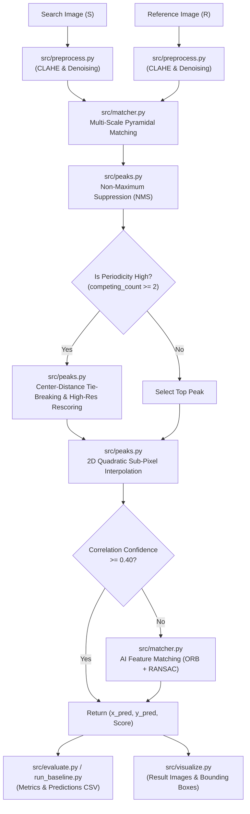

# Drift-Sense System Architecture

**Project**: Drift-Sense — Navigation-Error Recovery for Wafer Inspection Tools  
**Module Owners**: Member B (Algorithmic Core) & Shubh (Data & Evaluation)  

---

## High-Level Pipeline Architecture

---

## Component Responsibilities

### 1. Data Generation & Setup (`generate_synthetic.py`) — *Shubh / Member B*
- Generates synthetic wafer search images ($512 \times 512$) and reference target templates ($320 \times 320$, scale factor = 10).
- Produces ground truth CSV (`data/synthetic/ground_truth.csv`) with exact target center coordinates $(x_{\text{true}}, y_{\text{true}})$.

### 2. Preprocessing Engine (`src/preprocess.py`) — *Member B*
- `preprocess_image()`: Normalization, CLAHE histogram equalization, Gaussian filtering, and Sobel edge maps.

### 3. Core Matcher Engine (`src/matcher.py`) — *Member B*
- `locate_reference()`: End-to-end multi-scale normalized cross-correlation (NCC) matcher.
- `ai_feature_matching_fallback()`: ORB keypoint detection + RANSAC homography estimation fallback.

### 4. Peak Extraction & Signal Analytics (`src/peaks.py`) — *Member B*
- `find_peaks()`: Local NMS candidate peak extraction.
- `detect_periodicity()`: Quantitative grid periodicity metrics.
- `break_ties_by_center_distance()`: Composite fitness ranking incorporating physical stage drift distance prior.
- `refine_subpixel()`: 2D quadratic parabolic surface interpolation.

### 5. Evaluation & Visualization (`run_baseline.py`, `src/evaluate.py`, `src/visualize.py`) — *Shubh / Member B*
- Calculates positioning error in pixels $E = \sqrt{(x_{\text{pred}} - x_{\text{true}})^2 + (y_{\text{pred}} - y_{\text{true}})^2}$.
- Computes hit rates ($\le 1\text{px}, \le 3\text{px}, \le 5\text{px}, \le 10\text{px}$) and exports `results/metrics.csv` and `results/predictions.csv`.
